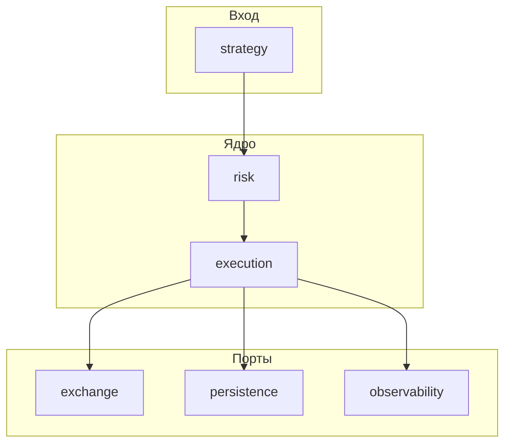

# okx-hft-executor

Исполнительный контур (execution core) для HFT / алгоритмической торговли на **OKX**: сигналы, risk, выставление и сопровождение ордеров, позиция, учёт, журнал, восстановление после сбоев и **reconciliation** с биржей.

Репозиторий сейчас содержит **архитектурный каркас**: структуру пакетов, контракты, документацию и минимальные заглушки. Реализация OKX REST/WebSocket, полноценного run-loop и БД — следующие этапы (см. [docs/roadmap.md](docs/roadmap.md)).

## Роль в системе

- Принимает или участвует в расчёте торговых сигналов (`strategy`).
- Проверяет ограничения и guard-ы (`risk`).
- Управляет жизненным циклом заявок и позиции (`execution`).
- Общается с биржей через изолированный слой (`exchange`).
- Пишет журнал и снимки состояния (`persistence`).
- Считает PnL, комиссии, качество исполнения (`accounting`).
- Обеспечивает наблюдаемость и операционные хуки (`observability`, `control`).

Подробные принципы и границы репозитория: [docs/architecture.md](docs/architecture.md).

## High-level архитектура



- **Domain-first**: язык системы зафиксирован в `domain/` (сигнал, ордер, fill, позиция, PnL-снимок, риск-событие, рынок).
- **Режимы** live / paper / replay подключаются подменой реализаций портов в `app/bootstrap.py`, а не ветвлением по всему коду ([docs/runtime_modes.md](docs/runtime_modes.md)).
- **Reconciliation** — обязательная часть устойчивого исполнения ([docs/reconciliation.md](docs/reconciliation.md)).

## Основные блоки

| Пакет | Назначение |
|-------|------------|
| [app](app/README.md) | Точка входа, bootstrap, оркестрация |
| [config](config/README.md) | Настройки и лимиты |
| [domain](domain/README.md) | Модели, enum, события, value objects |
| [strategy](strategy/README.md) | Сигналы, вход/выход, фильтры режима |
| [execution](execution/README.md) | Движок, менеджеры, state machine, reconciliation |
| [risk](risk/README.md) | Pre-trade, runtime, kill switch, guards |
| [exchange](exchange/README.md) | Порты и OKX-адаптеры |
| [persistence](persistence/README.md) | Репозитории, unit of work |
| [accounting](accounting/README.md) | PnL, fees, funding, execution quality |
| [services](services/README.md) | Clock, id, health helpers |
| [observability](observability/README.md) | Логи, метрики, tracing, алерты |
| [control](control/README.md) | Health / операционные хуки |
| [docs](docs/architecture.md) | Архитектура и процессы |
| [tests](tests/README.md) | unit / integration / replay |

## Как читать структуру

1. [docs/project_structure.md](docs/project_structure.md) — дерево каталогов.
2. [docs/trade_lifecycle.md](docs/trade_lifecycle.md) — цепочка от сигнала до persistence и reconciliation.
3. README в корне каждого пакета — границы ответственности и анти-паттерны.

## Локальный запуск каркаса

Требуется Python **3.11+**.

```bash
cd okx-hft-executor
python -m venv .venv
.venv\Scripts\activate
pip install -e .
python -m app.main --dry-run
```

Полный прогон без `--dry-run` запускает asyncio-заглушку оркестратора (без сети к бирже).

Разработка с линтерами и тестами:

```bash
pip install -e ".[dev]"
pytest tests/ -q
```

Опциональный control plane (FastAPI) — зависимость `pip install -e ".[control]"` (приложение в `control/app.py` — каркас под будущую реализацию).

## Переменные окружения

Пример: [.env.example](.env.example). Секреты не коммитить.

## Дальнейшее развитие

См. [docs/roadmap.md](docs/roadmap.md): фаза 1 (basic live), фаза 2 (resilient + reconciliation + WS), фаза 3 (platform: paper/replay, мульти-биржевые порты, расширенный учёт).

Рекомендуемый следующий шаг после каркаса: реализовать `exchange.okx.rest_client` + нормализацию в `adapter`, подключить `ExecutionEngine.run_forever` к очереди событий и persistence журнала, затем первый цикл `ReconciliationService` по REST snapshot.
