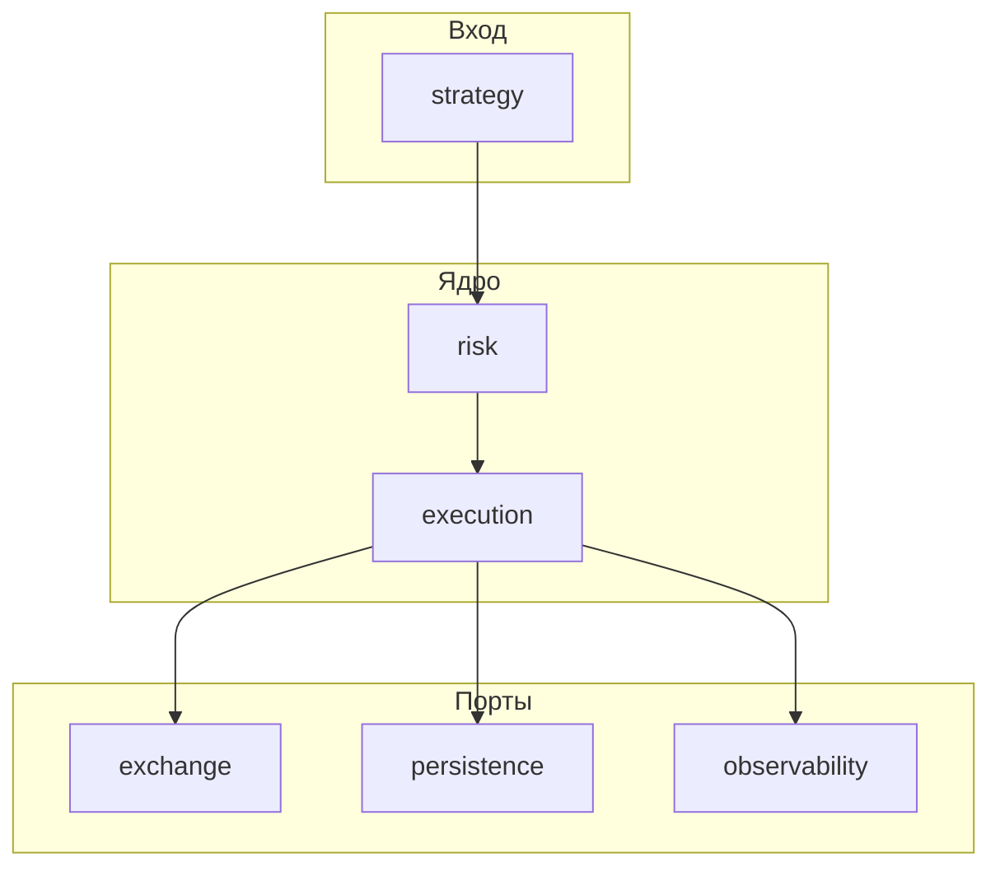

# okx-hft-executor

Рабочий baseline MVP для OKX (в т.ч. demo): стратегия принимает решение, выставляет **maker post-only** вход/выход, сопровождает позицию по TP/SL/timeout и пишет журнал в SQLite.

## С нуля до запущенного процесса

**Пошаговый гайд (окружение, `.env`, когда идут реальные запросы к OKX, команды, проверка, типовые сбои):** [docs/getting_started.md](docs/getting_started.md).

## Роль в системе

- Принимает или участвует в расчёте торговых сигналов (`strategy`).
- Проверяет ограничения и guard-ы (`risk`).
- Управляет жизненным циклом заявок и позиции (`execution`).
- Общается с биржей через изолированный слой (`exchange`).
- Пишет журнал и снимки состояния (`persistence`).
- Считает PnL, комиссии, качество исполнения (`accounting`).
- Обеспечивает наблюдаемость и операционные хуки (`observability`, `control`).

Подробные принципы и границы репозитория: [docs/architecture.md](docs/architecture.md).  

## High-level архитектура



- **Domain-first**: язык системы зафиксирован в `domain/` (сигнал, ордер, fill, позиция, PnL-снимок, риск-событие, рынок).
- **Режимы** live / paper / replay подключаются подменой реализаций портов в `app/bootstrap.py`, а не ветвлением по всему коду ([docs/runtime_modes.md](docs/runtime_modes.md)).
- **Reconciliation** — обязательная часть устойчивого исполнения ([docs/reconciliation.md](docs/reconciliation.md)).
- **Хранение данных** — SQLite (ops) + PostgreSQL `okx_exec` (аналитика): [docs/database/README.md](docs/database/README.md).

## Основные блоки

| Пакет | Назначение |
|-------|------------|
| [app](app/README.md) | Точка входа, bootstrap, оркестрация |
| [config](config/README.md) | Настройки и лимиты |
| [domain](domain/README.md) | Модели, enum, события, value objects |
| [strategy](strategy/README.md) | Сигналы, вход/выход, фильтры режима |
| [execution](execution/README.md) | Движок, менеджеры, state machine, reconciliation |
| [risk](risk/README.md) | Pre-trade, runtime, kill switch, guards |
| [exchange](exchange/README.md) | Порты и OKX-адаптеры |
| [persistence](persistence/README.md) | Репозитории, unit of work |
| [accounting](accounting/README.md) | PnL, fees, funding, execution quality |
| [services](services/README.md) | Clock, id, health helpers |
| [observability](observability/README.md) | Логи, метрики, tracing, алерты |
| [control](control/README.md) | Health / операционные хуки |
| [docs](docs/architecture.md) | Архитектура и процессы |
| [tests](tests/README.md) | unit / integration / replay |

## Как читать структуру

1. [docs/project_structure.md](docs/project_structure.md) — дерево каталогов.
2. [docs/trade_lifecycle.md](docs/trade_lifecycle.md) — цепочка от сигнала до persistence и reconciliation.
3. README в корне каждого пакета — границы ответственности и анти-паттерны.
4. [docs/project_overview.md](docs/project_overview.md) — актуальная карта проекта.
5. [docs/deployment_hybrid.md](docs/deployment_hybrid.md) — деплой и операции.
6. [docs/deployment_vps_runbook.md](docs/deployment_vps_runbook.md) — **VPS: Docker, .env, live, troubleshooting**.
7. [docs/control_api.md](docs/control_api.md) — управление стратегиями без SSH.

## Что работает сейчас (MVP)

- baseline strategy (`strategy/random_baseline`) с decision step 30 сек;
- интеграция с OKX v5 REST (`exchange/okx/rest_client.py`), при необходимости — заглушка (`stub_client`);
- вход и выход **post-only (maker)** с перестановкой по bid/ask;
- локальный контроль выхода по TP/SL/timeout;
- cooldown после закрытия;
- сверка позиции с биржей при расхождении (см. [docs/reconciliation.md](docs/reconciliation.md) и событие `position_reconciled` в SQLite);
- persistence в SQLite + PostgreSQL `okx_exec` (`trade_results` с gross/net PnL, комиссиями, execution metrics).

**Аналитика baseline:** `gross_pnl` — до комиссий, `net_pnl` — после; daily summary — `python scripts/trade_daily_summary.py` или view `okx_exec.v_trade_daily_summary`. Подробно: [docs/baseline_measurement.md](docs/baseline_measurement.md).

Подробно: [docs/baseline_demo_mvp.md](docs/baseline_demo_mvp.md).

## Локальный запуск (кратко)

Полная инструкция: [docs/getting_started.md](docs/getting_started.md).

**Windows (PowerShell):**

```powershell
cd D:\path\to\okx-hft-executor
python -m venv .venv
.\.venv\Scripts\Activate.ps1
pip install -e .
copy .env.example .env
# настройте .env (см. getting_started.md: safe_mode vs реальный OKX)
python -m app.main
```

**Linux / macOS:**

```bash
cd okx-hft-executor
python3 -m venv .venv
source .venv/bin/activate
pip install -e .
cp .env.example .env
python -m app.main
```

Остановить интерактивный запуск: `Ctrl+C`.

Короткий smoke-run с авто-остановкой:

```bash
python -m app.main --run-seconds 60
# или
python -m app.main --max-loops 120
```

Проверка OKX API без запуска торгового цикла:

```bash
python -m app.main --check-okx
```

## Docker Compose (хостовый / VPS запуск)

**Полный runbook для VPS:** [docs/deployment_vps_runbook.md](docs/deployment_vps_runbook.md)  
**CI/CD (push в main → автодеплой):** [docs/deployment_cicd.md](docs/deployment_cicd.md)  
Security: [docs/SECURITY_BASELINE_VPS_SSH_AND_NETWORK.md](docs/SECURITY_BASELINE_VPS_SSH_AND_NETWORK.md).

1) Подготовьте `.env` (не коммитить в git):

```bash
cp .env.example .env
```

2) На VPS перед первым `up` создайте `data/` и выставьте владельца `uid=100(app)` — иначе SQLite: `unable to open database file`. См. runbook §4.

3) Поднимите сервис:

```bash
docker compose up -d --build
```

4) Проверка:

```bash
docker compose ps
docker compose logs -f executor
```

5) Остановка:

```bash
docker compose down
```

- SQLite в `./data` → в контейнере `/app/data/baseline_mvp.sqlite3`.
- `control-api` на порту `8080` (ограничить UFW по IP).
- Live mode: `OKX_HFT_RUNTIME_MODE=live`, `OKX_HFT_SAFE_MODE=0`, ключи OKX — см. [getting_started.md](docs/getting_started.md).

## Strategy Manager (вариант C: hybrid)

По умолчанию сервис запускает **strategy manager**, который поднимает набор стратегий
из `OKX_HFT_STRATEGIES_JSON` (или одну `OKX_HFT_STRATEGY_NAME`, если JSON не задан).

Операции включения/отключения стратегии выполняются бесшовно через очередь команд в SQLite:

```bash
python -m app.main --strategy-enable random_baseline_v1
python -m app.main --strategy-disable random_baseline_v1 --strategy-disable-mode drain
python -m app.main --strategy-disable random_baseline_v1 --strategy-disable-mode force
python -m app.main --strategy-restart random_baseline_v1
python -m app.main --list-strategies
```

- `drain`: стратегия перестает открывать новые входы и корректно завершает текущий цикл.
- `force`: стратегия останавливается немедленно.
- Для legacy-режима одной стратегии используйте `--single-strategy`.

### Remote Control API (без SSH)

1) Задайте токен в `.env`:

```env
OKX_HFT_CONTROL_API_TOKEN=<long-random-token>
```

2) Поднимите сервисы:

```bash
docker compose up -d --build
```

3) Управляйте стратегиями по HTTP:

```bash
curl -H "X-API-Key: $OKX_HFT_CONTROL_API_TOKEN" http://<host>:8080/strategies
curl -X POST -H "X-API-Key: $OKX_HFT_CONTROL_API_TOKEN" -H "Content-Type: application/json" \
  -d '{"inst_id":"BTC-USDT-SWAP"}' http://<host>:8080/strategies/random_baseline_v1/enable
curl -X POST -H "X-API-Key: $OKX_HFT_CONTROL_API_TOKEN" \
  "http://<host>:8080/strategies/random_baseline_v1/disable?mode=drain"
curl -X POST -H "X-API-Key: $OKX_HFT_CONTROL_API_TOKEN" \
  http://<host>:8080/strategies/random_baseline_v1/restart
```

Рекомендуется закрывать порт 8080 через firewall или отдавать API только через reverse proxy с HTTPS и IP allowlist.

Разработка с линтерами и тестами:

```bash
pip install -e ".[dev]"
pytest tests/ -q
# опционально: make test (Unix) или команды из Makefile вручную на Windows
```

## Переменные окружения

Шаблон со всеми именами: [.env.example](.env.example). Секреты не коммитить.

Критично для поведения «реальные ордера / заглушка»:

- `OKX_HFT_RUNTIME_MODE` — `live` | `paper` | `replay`
- `OKX_HFT_SAFE_MODE` — при `1` всегда заглушка, без HTTP к бирже по ордерам
- `OKX_ENABLE_REAL_OKX_IN_PAPER` — при `paper` и `0` используется заглушка (если не включён safe_mode выше)

Таблица режимов и примеры: [docs/getting_started.md](docs/getting_started.md#stub-vs-okx-rest-reference).

Поведение baseline и логи: [docs/baseline_demo_mvp.md](docs/baseline_demo_mvp.md).
