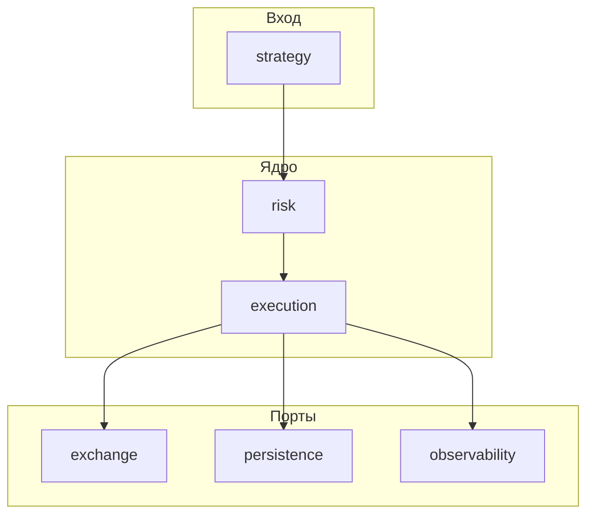

# okx-hft-executor

Рабочий baseline MVP для OKX demo: стратегия принимает решение, открывает market-позицию, сопровождает TP/SL/timeout и закрывает позицию, сохраняя результат в SQLite.

## Роль в системе

- Принимает или участвует в расчёте торговых сигналов (`strategy`).
- Проверяет ограничения и guard-ы (`risk`).
- Управляет жизненным циклом заявок и позиции (`execution`).
- Общается с биржей через изолированный слой (`exchange`).
- Пишет журнал и снимки состояния (`persistence`).
- Считает PnL, комиссии, качество исполнения (`accounting`).
- Обеспечивает наблюдаемость и операционные хуки (`observability`, `control`).

Подробные принципы и границы репозитория: [docs/architecture.md](docs/architecture.md).

## High-level архитектура



- **Domain-first**: язык системы зафиксирован в `domain/` (сигнал, ордер, fill, позиция, PnL-снимок, риск-событие, рынок).
- **Режимы** live / paper / replay подключаются подменой реализаций портов в `app/bootstrap.py`, а не ветвлением по всему коду ([docs/runtime_modes.md](docs/runtime_modes.md)).
- **Reconciliation** — обязательная часть устойчивого исполнения ([docs/reconciliation.md](docs/reconciliation.md)).

## Основные блоки

| Пакет | Назначение |
|-------|------------|
| [app](app/README.md) | Точка входа, bootstrap, оркестрация |
| [config](config/README.md) | Настройки и лимиты |
| [domain](domain/README.md) | Модели, enum, события, value objects |
| [strategy](strategy/README.md) | Сигналы, вход/выход, фильтры режима |
| [execution](execution/README.md) | Движок, менеджеры, state machine, reconciliation |
| [risk](risk/README.md) | Pre-trade, runtime, kill switch, guards |
| [exchange](exchange/README.md) | Порты и OKX-адаптеры |
| [persistence](persistence/README.md) | Репозитории, unit of work |
| [accounting](accounting/README.md) | PnL, fees, funding, execution quality |
| [services](services/README.md) | Clock, id, health helpers |
| [observability](observability/README.md) | Логи, метрики, tracing, алерты |
| [control](control/README.md) | Health / операционные хуки |
| [docs](docs/architecture.md) | Архитектура и процессы |
| [tests](tests/README.md) | unit / integration / replay |

## Как читать структуру

1. [docs/project_structure.md](docs/project_structure.md) — дерево каталогов.
2. [docs/trade_lifecycle.md](docs/trade_lifecycle.md) — цепочка от сигнала до persistence и reconciliation.
3. README в корне каждого пакета — границы ответственности и анти-паттерны.

## Что работает сейчас (MVP)

- baseline strategy (`strategy/random_baseline`) с decision step 30 сек;
- интеграция с OKX v5 demo REST (`exchange/okx/rest_client.py`);
- entry/exit market order;
- локальный контроль выхода по TP/SL/timeout;
- cooldown после закрытия;
- persistence в SQLite (`signals`, `orders`, `positions`, `trade_results`, `service_events`).

Подробно: [docs/baseline_demo_mvp.md](docs/baseline_demo_mvp.md).

## Локальный запуск

```bash
cd okx-hft-executor
python -m venv .venv
.venv\Scripts\activate
pip install -e .
copy .env.example .env
# заполните OKX_API_KEY / OKX_API_SECRET / OKX_API_PASSPHRASE
python -m app.main
```

Остановить запуск: `Ctrl+C`.

Короткий smoke-run с авто-остановкой:

```bash
python -m app.main --run-seconds 60
# или
python -m app.main --max-loops 120
```

Проверка OKX API без запуска торгового цикла:

```bash
python -m app.main --check-okx
```

Разработка с линтерами и тестами:

```bash
pip install -e ".[dev]"
pytest tests/ -q
```

## Переменные окружения

Пример: [.env.example](.env.example). Секреты не коммитить.

Минимальные demo-переменные:

```env
OKX_API_KEY=
OKX_API_SECRET=
OKX_API_PASSPHRASE=
OKX_FLAG_DEMO=1
OKX_BASE_URL=https://www.okx.com
OKX_INST_ID=BTC-USDT-SWAP
OKX_TD_MODE=cross
OKX_ORD_TYPE=market
OKX_ORDER_SIZE=1
OKX_HFT_SAFE_MODE=1
OKX_ENABLE_REAL_OKX_IN_PAPER=0
```

Практический гайд запуска и проверки: [docs/baseline_demo_mvp.md](docs/baseline_demo_mvp.md).
