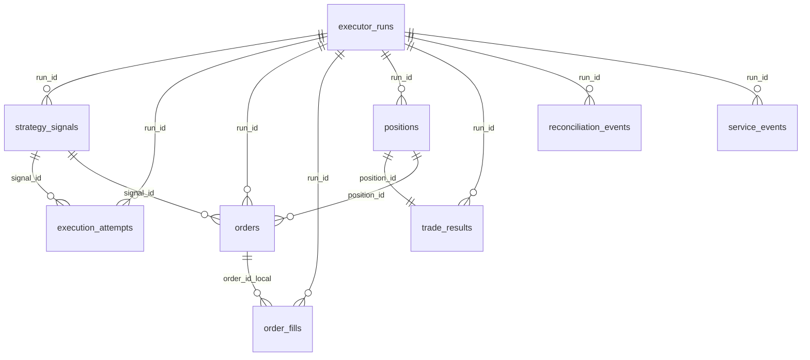

# Схема `okx_exec` (PostgreSQL / TimescaleDB)

DDL: [migrations/postgres/001_okx_exec_schema.sql](../../migrations/postgres/001_okx_exec_schema.sql)

## ER-диаграмма (логические связи)

## Hypertables (TimescaleDB)

Партиционирование по времени (`002_hypertables_indexes.sql`):

| Таблица | Time column |
|---------|-------------|
| strategy_signals | ts_decision |
| execution_attempts | ts_event |
| orders | ts_created |
| order_fills | ts_fill |
| reconciliation_events | ts_event |
| service_events | ts_event |

Обычные таблицы (без hypertable): `executor_runs`, `positions`, `trade_results`, `strategies_registry`, `strategy_commands`.

---

## `executor_runs`

Один запуск strategy loop / процесса (после `docker compose up`, рестарта, enable стратегии).

| Колонка | Тип | Описание |
|---------|-----|----------|
| run_id | BIGSERIAL PK | |
| run_uuid | UUID UNIQUE | внешний идентификатор run |
| started_at | TIMESTAMPTZ | |
| finished_at | TIMESTAMPTZ | NULL пока running |
| runtime_mode | TEXT | live / paper / replay |
| environment_name | TEXT | dev / prod |
| host_name | TEXT | hostname VPS |
| process_id | INT | pid контейнера/процесса |
| app_version | TEXT | git tag / commit (когда добавим) |
| strategy_name | TEXT | |
| model_name | TEXT | для ML-стратегий |
| inst_id | TEXT | |
| status | TEXT | running / stopped / error / draining |
| stop_reason | TEXT | force / drain / crash / … |
| extra_json | JSONB | snapshot конфига run |

**Когда писать:** старт loop → `status=running`; остановка → `finished_at`, `stop_reason`.

---

## `strategy_signals`

Бизнес-решение стратегии **до** отправки на биржу.

| Колонка | Тип | Описание |
|---------|-----|----------|
| signal_id | TEXT | PK (вместе с ts_decision) |
| run_id | BIGINT FK | |
| ts_decision | TIMESTAMPTZ | PK |
| strategy_name | TEXT | random_baseline_v1, … |
| model_name | TEXT | опционально |
| inst_id | TEXT | |
| side | TEXT | long / short / buy / sell |
| decision_type | TEXT | entry / exit / skip / flatten |
| confidence_score | NUMERIC | для моделей |
| take_profit_ticks | INT | из конфига стратегии |
| stop_loss_ticks | INT | |
| timeout_sec | INT | |
| market_snapshot | JSONB | bid/ask/last при решении |
| features_json | JSONB | фичи модели |
| reason_code | TEXT | |
| created_at | TIMESTAMPTZ | |

**Baseline:** одна строка на `make_decision()` (каждые ~30 с если условия выполнены).

---

## `execution_attempts`

**Ключевая таблица для «что сработало / что нет».**

| Колонка | Тип | Описание |
|---------|-----|----------|
| attempt_id | BIGSERIAL | PK (с ts_event) |
| attempt_uuid | UUID | |
| run_id | BIGINT FK | |
| signal_id | TEXT | |
| ts_event | TIMESTAMPTZ | PK |
| inst_id | TEXT | |
| strategy_name | TEXT | |
| action_type | TEXT | см. словарь ниже |
| side | TEXT | buy/sell если применимо |
| status | TEXT | ok / error / skipped / rejected |
| skip_reason | TEXT | cooldown / stale_ticker / … |
| reject_reason | TEXT | risk / guard |
| error_code | TEXT | OKX sCode, напр. 50102 |
| error_message | TEXT | |
| request_payload | JSONB | тело запроса |
| response_payload | JSONB | ответ OKX |

### Словарь `action_type` (рекомендуемый)

| action_type | Когда |
|-------------|-------|
| `submit_order` | place post_only / market |
| `cancel_order` | cancel перед reprice |
| `skip_decision` | should_decide=false |
| `reconcile_position` | startup / runtime reconcile |
| `api_call` | get_open_orders, get_positions, … |

---

## `orders`

Каждый submit и каждый **reprice** = **новая строка**.

| Колонка | Тип | Описание |
|---------|-----|----------|
| order_pk | BIGSERIAL | суррогатный PK |
| order_id_local | TEXT | client id (уникален в паре с ts_created) |
| run_id | BIGINT FK | |
| signal_id | TEXT | входной сигнал |
| attempt_id | BIGINT | связь с execution_attempts |
| position_id | TEXT | |
| trade_id | TEXT | после закрытия |
| inst_id | TEXT | |
| strategy_name | TEXT | |
| exchange_name | TEXT | okx |
| order_id_exchange | TEXT | ordId OKX |
| cl_ord_id | TEXT | как отправлено на OKX |
| parent_order_id_local | TEXT | предыдущий ордер при reprice |
| side | TEXT | buy / sell |
| position_action | TEXT | open / close / reduce |
| ord_type | TEXT | post_only / market |
| td_mode | TEXT | cross / isolated |
| pos_side | TEXT | hedge mode |
| reduce_only | BOOL | |
| price | NUMERIC | |
| size | NUMERIC | |
| filled_size | NUMERIC | |
| avg_fill_price | NUMERIC | |
| status | TEXT | submitted / live / filled / canceled / rejected |
| exchange_code | TEXT | |
| exchange_message | TEXT | |
| ts_created … ts_closed | TIMESTAMPTZ | lifecycle timestamps |
| raw_request_json | JSONB | |
| raw_response_json | JSONB | |

**Важно:** не обновлять строку при смене статуса «втихую» — лучше UPDATE статуса **той же** строки для одного order_pk, но **новый** order при reprice = новая строка + `parent_order_id_local`.

---

## `order_fills`

Одна строка на каждое исполнение с биржи.

| Колонка | Тип | Описание |
|---------|-----|----------|
| fill_id_exchange | TEXT | trade id OKX |
| order_pk / order_id_local | | связь с orders |
| fill_price, fill_size | NUMERIC | |
| liquidity_side | TEXT | maker / taker |
| fee, fee_ccy | | |
| pnl_realized_exchange | NUMERIC | reference с биржи |
| ts_fill | TIMESTAMPTZ | |
| raw_fill_json | JSONB | |

*Запись из кода — следующий этап разработки.*

---

## `positions`

| Колонка | Тип | Описание |
|---------|-----|----------|
| position_id | TEXT PK | |
| strategy_name | TEXT | |
| side | TEXT | long / short |
| status | TEXT | open / closed / reconciled / sync_lost |
| qty | NUMERIC | размер при открытии |
| qty_open | NUMERIC | текущий остаток |
| entry_signal_id | TEXT | |
| entry_order_id_local | TEXT | |
| exit_order_id_local | TEXT | |
| entry_price, exit_price | NUMERIC | |
| take_profit_ticks, stop_loss_ticks, timeout_sec | INT | снимок параметров |
| max_favorable_price, max_adverse_price | NUMERIC | для MFE/MAE |
| mfe_ticks, mae_ticks | NUMERIC | |
| entry_ts, exit_ts | TIMESTAMPTZ | |
| exit_reason | TEXT | tp / sl / timeout / maker_exit / sync_lost |
| updated_at | TIMESTAMPTZ | триггер `set_updated_at` |

---

## `trade_results`

Одна завершённая сделка = одна строка (1:1 с `position_id`).

| Колонка | Тип | Описание |
|---------|-----|----------|
| trade_id | TEXT PK | |
| position_id | TEXT FK | |
| entry_signal_id | TEXT | исходный signal_id (сохраняется при entry reprice) |
| gross_pnl | NUMERIC | до комиссий |
| entry_fee, exit_fee, fees_total | NUMERIC | комиссии; `fee_source` = `okx_fill` или `estimated_config` |
| net_pnl | NUMERIC | `gross_pnl - fees_total` |
| entry_liquidity, exit_liquidity | TEXT | `maker` / `taker` |
| close_source | TEXT | `executor_maker`, `executor_market_fallback`, `okx_reconcile`, … |
| exit_reason / final_exit_reason | TEXT | `tp`, `sl`, `timeout`, `reconcile`, … |
| entry_* / exit_* execution metrics | INT/NUMERIC | reprice/cancel counts, wait_sec, slippage_ticks |
| exit_market_fallback_used | BOOL | market reduce-only fallback после maker exit |
| holding_seconds | NUMERIC | |
| win_flag | BOOL | net_pnl > 0 |
| extra_json | JSONB | полный снимок execution metrics |

**gross_pnl vs net_pnl:** gross — разница цен × size без комиссий; net — после `fees_total`.
Дневной summary: view `okx_exec.v_trade_daily_summary` или `python scripts/trade_daily_summary.py`.

---

## `reconciliation_events`

| Колонка | Тип | Описание |
|---------|-----|----------|
| mismatch_type | TEXT | no_local_position / stale_sqlite / … |
| local_entity_type | TEXT | position / order |
| local_entity_id | TEXT | |
| exchange_entity_id | TEXT | |
| resolution_status | TEXT | detected / resolved |
| payload_json | JSONB | |

Примеры из кода: `position_reconciled_startup`, `reconcile_no_exchange_position`.

---

## `service_events`

Аудит и диагностика. Не заменяет `execution_attempts` для торговых метрик.

| Колонка | Тип | Описание |
|---------|-----|----------|
| component | TEXT | executor / strategy_manager / … |
| event_type | TEXT | |
| severity | TEXT | info / warning / error |
| message | TEXT | |
| payload_json | JSONB | |

---

## `strategies_registry` / `strategy_commands`

Дублируют функциональность SQLite для control plane в PG (опционально при dual-write).

- **registry:** `desired_state` (enabled/disabled), `runtime_state` (running/stopped/error)
- **commands:** очередь enable/disable/restart со статусом pending → done

---

## Индексы

См. `002_hypertables_indexes.sql`. Основные паттерны запросов:

- `(strategy_name, ts DESC)`
- `(inst_id, ts DESC)`
- `(signal_id)`
- `(status, strategy_name)` на orders
