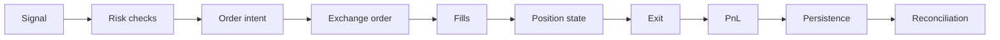

# Жизненный цикл торгового решения

Ниже — сквозной путь от сигнала до учёта и восстановления согласованности. Это **логическая** цепочка; физически шаги могут быть асинхронными и распределёнными по компонентам.

## Цепочка: signal → … → reconciliation

### 1. Signal

Вход: внешнее сообщение, внутреннее правило стратегии или агрегированное рыночное состояние (`domain`). На выходе — нормализованный **торговый сигнал** или отказ (no-op).

### 2. Risk checks

До создания намерения на ордер: pre-trade лимиты (размер, нотионал, концентрация, время, волатильность, stale data). При нарушении — **risk event**, отказ или ограничение; возможна эскалация в kill switch.

### 3. Order intent

Доменное намерение: инструмент, сторона, тип заявки, количество/цена, time in force, связь с сигналом. Ещё не wire-формат биржи.

### 4. Exchange order

`execution` + `exchange`: маппинг intent → запрос API; обработка `order_id`, статусов, ошибок; обновление локального представления заявки.

### 5. Fills

Поток исполнений (частичных и полных): обновление остатков заявки, переходы state machine, идемпотентность по идентификаторам исполнения.

### 6. Position state

Агрегированная позиция по инструменту/режиму маржи; связь с открытыми заявками и хеджирующими действиями.

### 7. Exit

Правила выхода (стратегия + execution policy): лимит/stop, снятие, перевод в ручной режим и т.д. Снова проходит через risk при необходимости.

### 8. PnL

`accounting`: реализованный/нереализованный результат, комиссии, funding (когда подключатся), оценка slippage относительно эталонной цены.

### 9. Persistence

Запись в устойчивое хранилище: события, снимки состояния, параметры для восстановления. Порядок записей должен поддерживать **воспроизведение** и аудит.

### 10. Reconciliation

Независимо от «счастливого» пути: периодическая сверка с биржей, разруливание расхождений, дополнение журнала корректирующими записями. См. [reconciliation.md](reconciliation.md).

## Границы ответственности по шагам

| Шаг | Основной блок |
|-----|----------------|
| Signal | `strategy`, `domain` |
| Risk | `risk` |
| Intent / state machine | `execution`, `domain` |
| Wire / transport | `exchange` |
| Учёт | `accounting`, `domain` |
| Долговечность | `persistence` |
| Сверка | `execution.reconciliation` + `exchange` |

## Обратные потоки

- Отказ API на шаге **Exchange order** → доменная ошибка, политика retry, алерт; состояние заявки «неизвестно» до сверки.
- **Runtime risk** может инициировать отмену или flatten на любом этапе при наличии позиции или активных заявок.

Этот документ следует согласовывать с `docs/architecture.md` и README пакетов при изменении контрактов.
